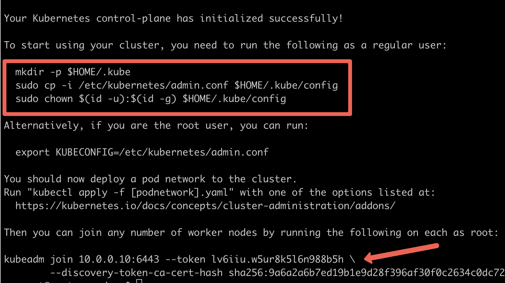
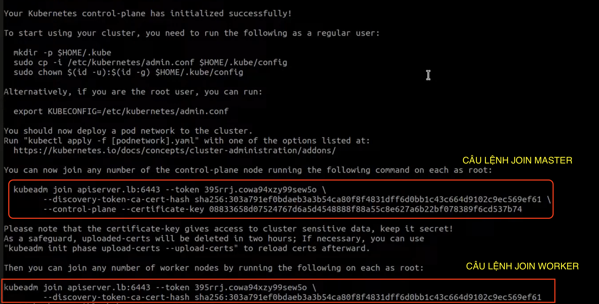

## Mục Lục

[I. CÀI ĐẶT CỤM K8S TRÊN NHIỀU NODE (VỚi LOAD BALANCER)](#i-cài-đặt-cụm-k8s-trên-nhiều-node-với-load-balancer)  
[II. CÀI ĐẶT CONTROL PLANE KUBERNETES DASHBOARD](#ii-cài-đặt-control-plane-kubernetes-dashboard)

# I. CÀI ĐẶT CỤM K8S TRÊN NHIỀU NODE (VỚi LOAD BALANCER)

## 1. Cài đặt Load Balancer (Nginx)

### Cập nhật hệ thống

```bash
sudo apt update && sudo apt upgrade -y
```

### Cài đặt Nginx

```bash
sudo apt install nginx -y
```

### Cấu hình Nginx làm Load Balancer cho API Server

```bash
cd /etc/nginx
sudo mkdir k8s-lb.d
cd k8s-lb.d/
sudo nano apiserver.conf
```

Thêm nội dung sau vào `apiserver.conf`:

```nginx
stream {
    upstream kubernetes {
        server master1_ip:6443 max_fails=3 fail_timeout=30s;
        server master2_ip:6443 max_fails=3 fail_timeout=30s;
        server master3_ip:6443 max_fails=3 fail_timeout=30s;
    }

    server {
        listen 6443;
        proxy_pass kubernetes;
    }
}
```

### Thêm cấu hình vào cuối file `nginx.conf`

```bash
sudo nano /etc/nginx/nginx.conf
```

Thêm dòng sau vào cuối file:

```nginx
include /etc/nginx/k8s-lb.d/*;
```

### Khởi động lại Nginx

```bash
sudo nginx -s reload
```

---

## 2. Cấu hình các Node (Master & Worker)

### Cập nhật hệ thống trên tất cả node

```bash
sudo apt update -y && sudo apt upgrade -y
```

### Cấu hình file hosts trên tất cả node

```bash
sudo vi /etc/hosts
```

Thêm các dòng IP tương ứng:

```
172.26.0.68     kmaster1
172.26.0.73     kmaster2
172.26.0.75     kmaster3
172.26.13.157   apiserver.lb
172.26.14.166   kworker1
172.26.14.167   kworker2
...
```

---

## 3. Cài đặt Container Runtime (containerd)

```bash
sudo apt update -y
sudo apt install -y containerd.io
```

### Cấu hình containerd

```bash
containerd config default | sudo tee /etc/containerd/config.toml >/dev/null 2>&1
sudo sed -i 's/SystemdCgroup = false/SystemdCgroup = true/g' /etc/containerd/config.toml
sudo systemctl restart containerd
sudo systemctl enable containerd
```

---

## 4. Cài đặt Kubernetes CLI và Engine

```bash
sudo apt update -y
sudo apt install -y kubelet kubeadm kubectl
sudo apt-mark hold kubelet kubeadm kubectl
```

---

## 5. Khởi tạo Cluster trên Master Node đầu tiên

```bash
sudo kubeadm init --control-plane-endpoint=apiserver.lb:6443 --upload-certs --pod-network-cidr=10.0.0.0/8
```



Thiết lập kubeconfig:

```bash
mkdir -p $HOME/.kube
sudo cp /etc/kubernetes/admin.conf $HOME/.kube/config
sudo chown $(id -u):$(id -g) $HOME/.kube/config
```

---

## 6. Cài đặt CNI Plugin (Cilium)

```bash
sudo apt install helm -y
helm repo add cilium https://helm.cilium.io/
helm install cilium cilium/cilium --version 1.11.6 --namespace kube-system
```

---

## 7. Thêm các node còn lại vào Cluster



### Trên 2 node Master còn lại:

```bash
sudo kubeadm join apiserver.lb:6443 --token <TOKEN> \
    --discovery-token-ca-cert-hash sha256:<HASH> \
    --control-plane --certificate-key <CERTIFICATE_KEY>

mkdir -p $HOME/.kube
sudo cp /etc/kubernetes/admin.conf $HOME/.kube/config
sudo chown $(id -u):$(id -g) $HOME/.kube/config
```

### Trên các node Worker:

```bash
sudo kubeadm join apiserver.lb:6443 --token <TOKEN> \
    --discovery-token-ca-cert-hash sha256:<HASH>
```

> Thay thế `<TOKEN>`, `<HASH>`, và `<CERTIFICATE_KEY>` bằng giá trị thực tế khi khởi tạo cluster.

---

## 8. Kiểm tra Cluster (Trên bất kỳ Master node nào)

```bash
kubectl get nodes
```

---

## ⚠️ Lưu ý

- Token chỉ tồn tại trong một thời gian ngắn, có thể tạo lại token không hết hạn bằng:

```bash
kubeadm token create --print-join-command --ttl 0
```

- Nếu cần reset Cluster cũ:

```bash
sudo kubeadm reset -f
sudo rm -rf /var/lib/etcd
sudo rm -rf /etc/kubernetes/manifests/*
```

---

## 🔗 Tham khảo

- [Video 1 - Cài đặt K8s](https://www.youtube.com/watch?v=xvVZCt5QR7k)
- [Video 2 - Cài đặt K8s chi tiết](https://www.youtube.com/watch?v=AGyGyzYPEjA)

# II. CÀI ĐẶT CONTROL PLANE KUBERNETES DASHBOARD

## 1. Thêm Helm Repository và Cài Đặt Dashboard

```bash
helm repo add kubernetes-dashboard https://kubernetes.github.io/dashboard/
helm repo update

helm upgrade --install kubernetes-dashboard kubernetes-dashboard/kubernetes-dashboard \
  --create-namespace --namespace kubernetes-dashboard
```

---

## 2. Expose Dashboard Service ra ngoài bằng NodePort

```bash
kubectl expose deployment kubernetes-dashboard \
  --name k8s-dash-svc \
  --type NodePort \
  --port 443 \
  --target-port 8443 \
  -n kubernetes-dashboard
```

---

## 3. Kiểm Tra Dashboard Đã Chạy

```bash
kubectl get pods,svc -n kubernetes-dashboard
```

> 📌 Ghi lại NodePort được hiển thị trong kết quả (ví dụ: `31000`).

---

## 4. Cấu Hình Load Balancer với NGINX

### Cập nhật NGINX (trên Load Balancer):

**Thêm nội dung sau vào `/etc/nginx/conf.d` hoặc `/etc/nginx/k8s-lb.d/apiserver.conf`:**

```nginx
upstream dashboard_nodes {
    server 172.26.0.68:31000 max_fails=3 fail_timeout=30s;
    server 172.26.15.240:31000 max_fails=3 fail_timeout=30s;
    server 172.26.13.162:31000 max_fails=3 fail_timeout=30s;
}

server {
    listen 31000;

    location / {
        proxy_pass https://dashboard_nodes;
        proxy_ssl_verify off;
    }
}
```

> 📌 Thay `31000` bằng NodePort bạn đã thấy ở bước trên nếu khác.

### Khởi động lại NGINX:

```bash
sudo nginx -t
sudo systemctl restart nginx
```

---

## 5. Truy Cập Dashboard

Mở trình duyệt:

```
https://<IP_LoadBalancer>:31000
```

---

## 6. Tạo Admin User Cho Dashboard

```bash
cat <<EOF | kubectl apply -f -
apiVersion: v1
kind: ServiceAccount
metadata:
  name: admin-user
  namespace: kubernetes-dashboard
---
apiVersion: rbac.authorization.k8s.io/v1
kind: ClusterRoleBinding
metadata:
  name: admin-user
roleRef:
  apiGroup: rbac.authorization.k8s.io
  kind: ClusterRole
  name: cluster-admin
subjects:
- kind: ServiceAccount
  name: admin-user
  namespace: kubernetes-dashboard
EOF
```

---

## 7. Lấy Token Đăng Nhập Dashboard

```bash
kubectl -n kubernetes-dashboard create token admin-user
```

Copy token này và sử dụng để đăng nhập vào Dashboard.

---

## ✅ Kết Quả Mong Đợi

Khi truy cập `https://<LoadBalancer-IP>:31000`, nếu hiện ra giao diện đăng nhập Kubernetes Dashboard, bạn đã cấu hình thành công 🎉

---

## 📌 Ghi chú

- Đảm bảo cổng `31000` đã được mở trên firewall/NACL/Security Group của Load Balancer.
- Nếu có nhiều master node, nên cấu hình HA hoặc Keepalived cho NGINX nếu cần tính sẵn sàng cao.
